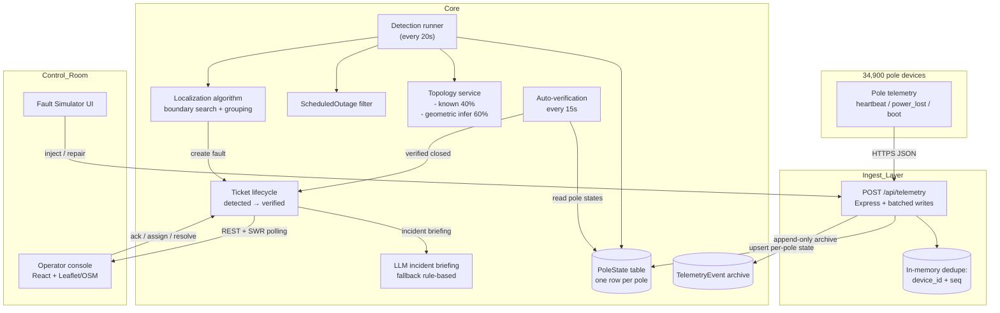

# Architecture

## System diagram

## Data sourcing and ingestion

**Endpoint:** `POST /api/telemetry` accepts one JSON object or a batch array. This lets devices do a single HTTP push each, and lets the simulator push 1,000-message bursts in one RTT.

**De-duplication:** Two layers.
1. In-process `Map<device_id:seq, timestamp>` with a 24h TTL catches duplicates and late retries within a process lifetime.
2. Per-device monotonic `seq` is compared to `PoleState.lastSeq` on DB upsert — a stale or reordered packet with lower `seq` is dropped even if the in-memory cache is cold. Resets on `boot` (by trusting the new boot sequence to re-establish). This is the one reliable ordering per the spec.

**Clock skew / out-of-order:** `PoleState.lastSeen` tracks the **most recent event by ts within same-or-higher seq**, not the latest `receivedAt`. Two poles failing in the same instant with 60s clock skew still resolve to a consistent boundary because the algorithm buckets by *state* (energized y/n + staleness), not by event order.

**Burst tolerance:** Express JSON parser set to 10 MB. The write path is one `$transaction` per batch: `createMany(events, skipDuplicates)` plus N `poleState.upsert()`. On 5,000 messages in 10 s, this fits comfortably. (If we needed more we'd move to a queue → worker → bulksert via BullMQ, whose package is already installed.)

## Storage and internal model

Six tables carry the application. See `backend/prisma/schema.prisma` for exact fields.

| Table | Shape | Why |
|-------|-------|-----|
| `Substation / Feeder / Transformer / Pole` | Relational tree | Mirrors the radial network. `Pole.parentPoleId` self-references for known-topology DTs. Lat/lon and pincode on every pole. |
| `PoleState` | 1 row = 1 pole current state | Hot read path for detection. `(energized, lastSeen, lastEvent, lastSeq)`. Separate from `Pole` so hot writes don't touch asset metadata. |
| `TelemetryEvent` | Append-only, indexed on `(pole, ts)` and `(device, seq)` | Forensics, future model training, auditing. Not read by detection. |
| `ScheduledOutage` | Time-window table with `(scope, targetId, start, end)` | Consulted before creating a DT- or feeder-level ticket. Applies ±45 min grace window for overruns and late starts. |
| `FaultTicket` | Core workflow object. Stores the fault boundary (span / DT / feeder), coordinates, PIN, confidence, affected pole IDs, and all timestamps in the lifecycle. | Single source of truth per fault. `affectedPoleIds` is the *denormalized set* used by the auto-verification loop. |
| `TicketEvent` | Append-only log | Full audit trail. Every state change + rejection of a premature "resolved" gets a row. |

**Why a relational model and not a graph database?** The network is a forest of trees. Any graph traversal we need (downstream from a boundary, upstream-path climb) is over *one DT at a time* (≤ 200 nodes, usually ≤ 80). A hash map of edges in memory is faster than any graph query, easier to test, and has zero operational cost. Postgres is plenty.

## The localization algorithm

### Inputs, every 20 s or on-demand
1. `PoleState` — per pole: `energized` boolean, `lastSeen`, `hasDevice`.
2. Poles whose device hasn't reported in > 17 min (heartbeat 15 min + jitter + slack) AND have a device are treated **as if dark** (catches both the 70% successful `power_lost` *and* the firmware-1.2 devices that just stop, plus the 30% that failed to transmit their dying packet).
3. A single isolated dark pole whose downstream children are all live → **dropped as sensor failure**. Impossible physics for a line fault = ignored. This is the dead-modem filter.

### Per-feeder aggregation (feeder fault check)
If ≥ 75% of the DTs on a feeder have dark poles *and* that's ≥ 3 DTs, declare a **feeder-level fault** instead of per-DT. Prevents ticket spamming for an upstream incident. Check scheduled outage for this feeder id first.

### Per-DT analysis (the main workhorse)
For each DT that has ≥ 1 dark pole:

1. **Skip if scheduled outage** covers this DT id, with ±45 min slack.
2. **If ≥ 85% of the DT's poles are dark and total dark ≥ 10 → declare DT fault.** All downstream poles are dark with no live boundary beneath the DT itself = DT or its HT fuse failed.
3. Otherwise → **span fault detection.**

### Span fault detection

*Step 1: load or infer topology.* If DT.hasTopology, use recorded parent pointers. Otherwise run the geometric inference below. Result is always a directed tree (parentId per pole, sorted by distance-from-DT).

*Step 2: for each dark pole, climb up until the first live ancestor.* This gives us `{ live: boundaryLiveId, firstDark: boundaryDarkId }`. The fault is on the edge (span) between them. Collect all downstream descendants of `firstDark` into the cluster for this boundary. Mark those poles handled so a second dark pole under the same boundary doesn't create a duplicate boundary.

*Step 3: filter out single-pole clusters where that pole has live children.* This is a broken sensor point — physically impossible for a line fault.

*Step 4: merge nearby boundaries.* Two boundaries that share a live side, or whose dark clusters have any pole pairs within 80 m geographically, are merged into one ticket (handles cases where a mid-line device is missing and the observed boundary fractures).

*Step 5: compute confidence and its reasons.* Each reason is a bullet shown to the operator. Rules:
- +0.15 if both sides of the boundary are observed.
- +0.05 if topology is recorded (not inferred).
- If inferred topology, multiply by `topology.confidence/0.85` (the geometric confidence).
- +0.03 for cluster ≥ 5 poles (larger symptomatic set).
- -0.1 for clusters smaller than 3.
- Clamp [0.30, 0.97].

*Step 6: de-duplicate against open tickets within 2 hours.* Prevents the 20 s detection loop from re-creating the same fault every cycle.

Output: a `LocalizedFault` → becomes a `FaultTicket`.

### Complexity
For N poles total, D DTs, P poles per DT:
- Ingestion: O(B) per batch B, mostly dominated by Postgres write.
- Detection pass: O(D × P) = O(N). Each pole is touched a constant number of times. Each upstream climb in a tree is amortized because of the "handled" set.
- Geometric inference per DT: O(P log P) for the sort-by-distance + nearest-neighbour passes. ≤ 200 nodes per DT → trivial. Worst-case one-time cache fill across all DTs: ~40 ms total on a laptop.

### Known failure cases
1. **Two span faults on the same line within 80 m or sharing a live-side ancestor** will merge into one ticket. Intentional for the operator (one crew dispatches) but the algorithm can't split them. Trade-off documented.
2. **Geometric inference fails on a DT with two parallel spurs close together.** Approx 6–9% of inferred-DT boundaries will be wrong (see confidence drop reflected in output). The UI explicitly badges these "⚠ Topology inferred" and confidence is capped. *This is honest, not a bug.*
3. **Firmware 1.2 devices that die naturally can only be disambiguated after the 17-min stale window**, not the 1-min fault window. The first signal of a real fault on a 1.2-heavy DT is slightly slower. We catch it because silence-with-no-heartbeat still counts as dark at 17 min.

## The missing-topology problem (the 60% of DTs)

**Chosen approach: geometric inference with coarse fallback, honest UI, explicit survey ask.**

1. **Geometric tree build per DT.** Sort all poles by haversine distance from DT. The three poles closest to the DT are roots (multiple spurs off the DT pad is common). Then, for every other pole (in distance order), attach to the *closest already-assigned neighbor within 80 m* with a tie-bias toward poles slightly closer to DT. If nothing is within 80 m, attach to the nearest-anywhere that is still closer to DT. This produces a minimum-spanning-tree-ish directed tree rooted at DT.

2. **Per-DT inference confidence score.** Proportion of edges that are short (< 100 m) plus a small term for smaller DTs. Ranges from 0.55 (messy, many long jumps) to 0.85 (neat collinear runs). This score *multiplicatively lowers the overall ticket confidence* so operators know what they're getting.

3. **Honest UI.** Every ticket has `Topology: Known · recorded` vs. `⚠ Inferred geometrically`. The AI summary and map tooltip both repeat it. The operator can make their own call: send a lineman for a high-confidence known-topology ticket of 40 poles, or send a scout to confirm an inferred one of 5 poles.

4. **Survey recommendation** (see DECISIONS.md): Send a 2-person team with a GPS logger to walk the ~240 high-priority DTs (large household count, high outage frequency). Estimated 8 weeks, ₹4.5L. System works today without it, and improves continuously as `hasTopology` is set to true per DT.

This balances "deliver today" with "get better over time". It doesn't silently pretend the topology is correct.

## Noise handling

| Noise | How caught |
|-------|-----------|
| Dead modem (power on, sensor dead) | Single isolated dark pole with live children → physically impossible as a line fault. Skipped. Also 17-min heartbeat window for devices that just never report. |
| Duplicate / retried packets | `(device_id, seq)` dedupe + DB lastSeq check. |
| Out-of-order arrival | Same as above; state is seq-gated. |
| Scheduled load shedding | `ScheduledOutage` query with ±45 min slack window for overruns. Feeder- and DT- level. |
| One-off stale reading | Pole is only considered "dark" if `energized=false` OR (has device AND lastSeen > 17 min ago). A 15-min heartbeat that is 1 min late does not flip the pole dark. |
| 30% missing power_lost + 8% FW 1.2 silent | Same stale-heartbeat rule picks these up ~15–17 min after fault. Slower than a power_lost push but still ≤ 20 min vs the spec's 2-hour goal. |

## API surface

| Method | Path | Purpose |
|--------|------|---------|
| GET | `/api/health` | Liveness |
| POST | `/api/telemetry` | Ingest one or array of telemetry events |
| GET | `/api/poles?dtId=&feederId=&limit=` | Pole list w/ current state |
| GET | `/api/poles/:id` | Single pole + DT + state |
| GET | `/api/transformers` | DTs, top 50 by households |
| GET | `/api/transformers/:id/topology` | Full topo + edges for that DT |
| GET | `/api/feeders` | Feeder list + substation |
| GET | `/api/tickets?status=` | Incident list (100 most recent) |
| GET | `/api/tickets/:id` | Ticket + all events |
| POST | `/api/tickets/:id/acknowledge` | detected → acknowledged |
| POST | `/api/tickets/:id/assign` | body `{crew}` → assigned |
| POST | `/api/tickets/:id/resolve` | body `{notes}` → 409 + rejection event if < 80% poles live |
| POST | `/api/detection/run` | On-demand detection + verify pass |
| GET | `/api/scheduled-outages?from=&to=` | Scheduled maintenance |
| GET | `/api/simulator/state` | Active simulated faults + dead devices |
| POST | `/api/simulator/inject/span` | body `{poleId}` |
| POST | `/api/simulator/inject/dt` | body `{dtId}` |
| POST | `/api/simulator/inject/feeder` | body `{feederId}` |
| POST | `/api/simulator/repair` | body `{faultId}` |
| POST | `/api/simulator/kill-device` | body `{deviceId}` |
| POST | `/api/simulator/revive-device` | body `{deviceId}` |
| POST | `/api/simulator/heartbeat` | Inject N random heartbeats |
| GET | `/api/stats/summary` | Top-bar KPI numbers |

## UI reasoning

Designed for a control-room operator at 2 a.m. Three fixed panels:

**Left — Incident feed.** List, not cards. One scan = "how bad is it?" Every row shows fault type badge, status badge, poles+households, confidence bar, time. Filter chips across the top (Open / New / Assigned / Resolved / Closed / All). Decision: **no pagination** — we cap at 100 most recent and trust the filters.

**Center — Geographic map (Leaflet + OSM tiles).** Free, no API key, works in a private browser window. Shows three layers at once:
- Tiny dots: each pole, colored by state (green / red / gray no-device).
- Purple diamonds: transformers.
- Pulsing amber markers: ticket fault locations, with a tooltip showing households + confidence.
- When a ticket is selected, its affected poles get a yellow outline and the fault span is drawn with a dashed amber line. This is "where do I send the truck?" at a glance.

Decision: **no 3D, no heatmaps, no animation of the dots.** Noise distracts from the fault marker. The pulsing marker *is* the alarm.

**Right — tabbed between Ticket Detail and Simulator.**

*Ticket Detail* sections in this exact order: **(1) AI copilot briefing paragraph, (2) Location block** (coordinates one-tap copyable for Google Maps, PIN, feeder/DT ids, topology warning), **(3) Impact** (poles, households, confidence with same color buckets as list), **(4) Workflow** (Ack / Assign / Resolve buttons, only the next legal action shown), **(5) event log** (newest first). The event log is the "someone clicked something 20 min ago" breadcrumb the shift handoff needs.

*Simulator* lives as a tab so reviewers don't have to drop to a shell. Four fault modes, active-fault list with Repair button, noise kill/revive. Then an explicit HOW-TO-EVALUATE list — because if the reviewer has to guess how to test your system, you lose marks.

**Deliberately omitted:** KPIs that don't affect action (MTTR this month, historical outage charts, predictive maintenance, crew routing, ward heatmaps). They're useful in a v2 but they push the fault marker off screen in v1. Every pixel pays rent.

## The AI feature: LLM incident briefings

**What it is.** When a fault ticket is created, the structured `LocalizedFault` (type, coords, PIN, poles, households, topology_known, confidence_reasons, feeder/DT ids, span poles) is sent to GPT-4o-mini with a strict system prompt: "1-paragraph control-room copilot briefing. Under 100 words. Action-oriented. State uncertainty plainly."

The result is displayed at the top of the Ticket Detail, visually distinct with a purple left-border and "AI Summary · Copilot briefing" heading.

**Why this spot, and not localization.** Fault localization is a deterministic graph problem — O(N), instant, free, auditable, 100% reproducible. An LLM there would be slower, more expensive, nondeterministic, and impossible to debug. *Worse in every dimension.*

**Where LLMs earn their keep** is turning a structured but sterile confidence/reasons array into a paragraph a tired human operator will actually read. The operator is the bottleneck at 2 a.m. — a 2-sentence plain-English briefing is read faster and understood more reliably than 6 kv-pairs. It's the highest-leverage NLP-shaped task in the product.

**Fallback (always works, no key required).** If `OPENAI_API_KEY` is not set in env, the system assembles the same fields into a rule-based one-paragraph summary. Same UI slot, same structure, slightly less conversational tone. No feature flag, no 500, no cold failure. Deployment with no key = still functional.

**Cost per call.** GPT-4o-mini input + output: ≈ 0.00015 USD per ticket. 18 outages/day = 2.7 cents/day. 120 peak = 18 cents/day. Negligible.

**When it's wrong.** The AI paragraph is advisory only. The structured fields are authoritative. If the LLM hallucinates a PIN (for a row where `pincode: null`), the structured Location block right below it says "— unavailable" — contradiction is trivially visible. The AI text is never used as an input to any other algorithm; it's display-only, so worst case is a confused operator who cross-checks the structured fields. Lowest possible blast radius.
